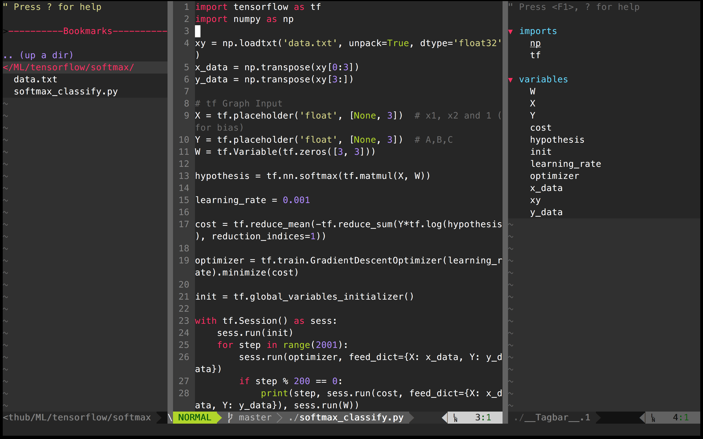

## settings

settings i used for development environments

### VIM setting files

- .vimrc
- colors(molokai) from [`https://github.com/tomasr/molokai`](https://github.com/tomasr/molokai)

#### Directories

- `~/.vimrc`  - *setting file*

- `~/.vim/bundle/Vundle.vim`   - *Bundle file*

- `~/.vim/colors/` - *Color themes*

  ​

#### Install guide

`$ git clone https://github.com/gmarik/Vundle.vim.git ~/.vim/bundle/Vundle.vim` - *git vundle install*

**Install command** : `:PluginInstall` in .vimrc

#### color themes

http://cocopon.me/app/vim-color-gallery/

#### Plugins

- 'gmarik/Vundle.vim' "required - *For plugin install* [link](https://github.com/gmarik/Vundle.vim.git )
- 'tpope/vim-fugitive' "required - *For Git* [link](https://github.com/tpope/vim-fugitive)

- 'tmhedberg/SimpylFold' - *Folding* [link](https://github.com/tmhedberg/SimpylFold)

- 'nvie/vim-flake8' - *Syntax check* [link](https://github.com/nvie/vim-flake8)

- 'scrooloose/nerdtree' - *directory tree* [link](https://github.com/scrooloose/nerdtree)

- 'jistr/vim-nerdtree-tabs' - *directory tree* [link](jistr/vim-nerdtree-tabs)

- 'scrooloose/nerdcommenter' - *directory tree* [link](https://github.com/scrooloose/nerdcommenter)

- 'Lokaltog/powerline', {'rtp': 'powerline/bindings/vim/'} - *below status bar* [link](https://github.com/Lokaltog/vim-powerline)

- 'mattn/emmet-vim' - *expanding abbreviations* [link](https://github.com/mattn/emmet-vim)

  ​

#### Commands

**syntax check** :  `F7`

**show tree** : `Ctrl+n`

**Folding** : `space`

#### Errors

*To solve `value Error:unkown locale: UTF-8`*

`export LC_ALL=en_US.UTF-8` and `export LANG=en_US.UTF-8`
